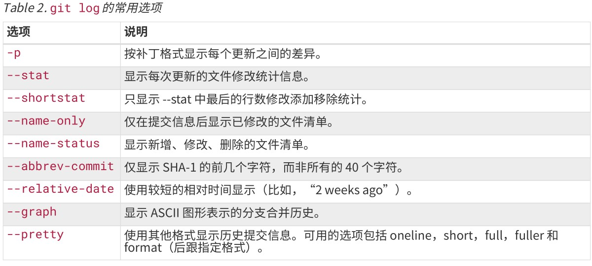

# GIT常用命令合集

## 一、常用指令合集

| 功能                         | 指令                       |
| :--------------------------- | -------------------------- |
| 新建仓库                     | git init                   |
| 添加文件到暂存区             | git add  文件名            |
| 将文件从暂存区提交到仓库     | git commit -m '提交的注释' |
| 显示工作目录和暂存区的状态   | git status                 |
| 比较工作区和暂存区的内容     | git diff 文件名            |
| 查看历史版本                 | git log                    |
| 查看历史版本（一行显示）     | git log --pretty=oneline   |
| 回退版本号                   | git reset --hard 版本号    |
| 查看引用日志                 | git reflog                 |
| 撤销工作区文件的修改         | git checkout --文件名      |
| 撤销已经提交到暂存区中的修改 | git reset HEAD 文件名      |
|                              |                            |
|                              |                            |

## 二、附录：

### 1、log常用选项

